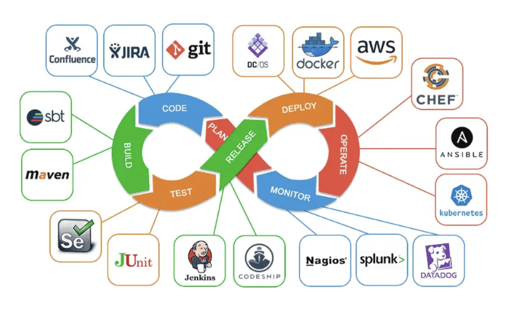

# Quest 17-B. 배포 파이프라인

## Introduction

- 이번 퀘스트에서는 CI/CD 파이프라인이 왜 필요한지, 어떻게 구축할 수 있는지 등에 대해 다룹니다.

## Topics

- Continuous Integration
- Continuous Delivery
- AWS Codebuild

## Resources

- [AWS: Continuous Integration](https://aws.amazon.com/ko/devops/continuous-integration/)
- [AWS: Continuous Delivery](https://aws.amazon.com/ko/devops/continuous-delivery/)
- [AWS Codebuild](https://aws.amazon.com/ko/codebuild/getting-started/)

## Checklist

- **`CI/CD는 무엇일까요? CI/CD 시스템을 구축하면 어떤 장점이 있을까요?`**

 

**
 💡CI/CD란? 
**

 

 

> CI/CD는 Continuous Integration (CI)과 Continuous Delivery (CD)의 합성어로서, 소프트웨어의 개발과정에서 개발자가 코드 변경사항을 자주 검증하고 릴리즈하는 것을 지원하는 자동화된 프로세스입니다.

> CI는 개발자가 작성한 코드가 정기적으로 빌드되고 테스트되어 소프트웨어의 품질을 보장하는 것을 의미합니다. 즉, 코드 변경이 일어날 때마다 자동으로 빌드 및 테스트를 수행하고 그 결과를 공유하는 것입니다.

> CD는 CI를 기반으로 소프트웨어 릴리즈를 자동화하여 지속적으로 배포하는 것을 의미합니다. CD는 소프트웨어를 릴리즈하기 위한 작업을 자동화하여 수작업으로 수행할 필요성을 줄여줍니다.

   

**
💡CI/CD의 장점
**

 

> **빠른 피드백** : CI/CD 시스템을 통해 코드 변경사항이 자동으로 테스트되고 빌드되므로, 오류를 빨리 발견하고 수정할 수 있습니다. 이로 인해 릴리즈 사이클이 짧아지고, 더욱 신속하게 개발 및 배포를 수행할 수 있습니다.

> **자동화된 빌드 및 배포** : CI/CD 시스템은 개발자의 코드 변경사항을 자동으로 빌드하고, 배포할 수 있습니다. 이로 인해 릴리즈 프로세스를 자동화하고, 수작업으로 수행할 필요성을 줄여줍니다.

> **높은 품질**: CI/CD 시스템을 통해 자동화된 테스트를 수행하면, 코드의 품질을 보장할 수 있습니다. 이로 인해 사용자에게 더욱 높은 품질의 소프트웨어를 제공할 수 있습니다.
> 작업 효율성 향상: CI/CD 시스템을 통해 자동화된 릴리즈 프로세스를 구축하면, 개발자와 운영팀의 작업 효율성을 향상시킬 수 있습니다.

 
 
 

- **`CI 시스템인 Travis CI, Jenkins, Circle CI, Github Actions, AWS Codebuild 의 차이점과 장단점은 무엇일까요?`**

 

**
💡차이점과 장담점 
**

 

> **Travis CI** :
> 분산 빌드 환경을 지원하며, GitHub과의 연동이 강점입니다.
> Ruby, Node.js, Java, Python 등의 언어를 지원합니다.
> 클라우드 기반으로 호스팅되어있으며, 매우 쉬운 설정 방법으로 빠르게 구축할 수 있습니다.
> 단점으로는 대부분의 기능이 유료 버전에서만 제공되며, 커스터마이징이 제한적입니다.

> **Jenkins** :
> 오픈소스로 제공되는 CI 도구로, 다양한 플러그인을 지원합니다.
> 대규모 프로젝트에서 사용 가능한 매우 강력한 CI 기능을 제공하며, 거의 모든 언어를 지원합니다.
> 다양한 확장성과 유연성을 가지고 있으며, 복잡한 파이프라인을 구축할 수 있습니다.
> 다양한 플러그인이 존재하지만, 설정이 복잡하고 유지보수가 어려울 수 있습니다.

> **Circle CI** :
> 클라우드 기반의 CI 도구로, 간편한 설정 방법과 높은 성능을 가지고 있습니다.
> Docker와 연동이 가능하며, 다양한 언어와 프레임워크를 지원합니다.
> 강력한 분산 빌드와 테스트를 지원하며, 간편한 설정과 높은 확장성을 가지고 있습니다.
> 다른 클라우드 CI 도구에 비해 높은 가격을 가지고 있으며, 한계가 있을 수 있습니다.

> **Github Actions** :
> Github에서 제공하는 CI/CD 도구로, Git과의 연동이 강점입니다.
> Docker와 연동이 가능하며, 다양한 언어와 프레임워크를 지원합니다.
> 매우 쉬운 설정 방법과 높은 확장성을 가지고 있으며, Github에서 호스팅되어 기존의 깃헙 레포지토리와의 연동이 용이합니다.
> 비교적 새로운 도구로 인해 플러그인이나 템플릿 등의 다양한 자원이 부족할 수 있습니다.

> **AWS CodeBuild**
> AWS CodeBuild: AWS CodeBuild는 AWS에서 제공하는 CI 서비스입니다. 클라우드 기반으로 구축되어 있으며, AWS에서 다양한 프로그래밍 언어와 프레임워크를 지원합니다. 또한, Docker 이미지를 사용하여 환경을 구성하므로 더욱 편리하게 사용할 수 있습니다.
> AWS CodeBuild의 장점은 AWS와의 통합성이 높다는 것입니다. AWS에서 다양한 서비스와 연동하여 사용할 수 있기 때문에, AWS를 활용하는 경우 통합성이 중요한 요소가 되기도 합니다. 또한, 다양한 플랫폼을 지원하며, 빌드 환경을 직접 구성할 수 있어서 필요한 의존성을 정확하게 관리할 수 있습니다.
> 하지만 AWS CodeBuild는 기능이 다른 CI 서비스들에 비해서는 상대적으로 적습니다. 또한, AWS의 클라우드 기반으로 구축되어 있기 때문에, 기본적인 설정이나 사용 방법 등이 다른 서비스와는 조금씩 차이가 있을 수 있습니다. 또한, 다른 서비스들에 비해 사용 비용이 비싸다는 단점도 있습니다.

---

## Quest

- AWS Codebuild를 이용하여, 특정 브랜치에 푸시를 하면 린트와 테스트를 거쳐 서버 이미지를 빌드한 뒤, 직전 퀘스트의 EC2 인스턴스에 배포되는 시스템을 만들어 보세요.

## Advanced

- 빅테크 회사들이 코드를 빌드하고 배포하는 시스템은 어떻게 설계되고 운영되고 있을까요?
